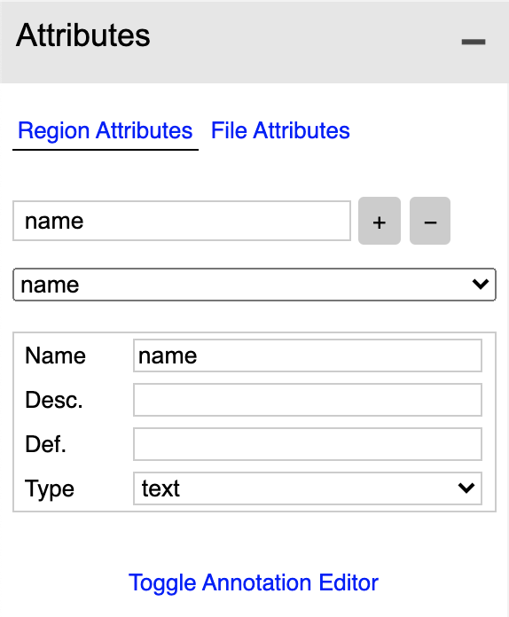
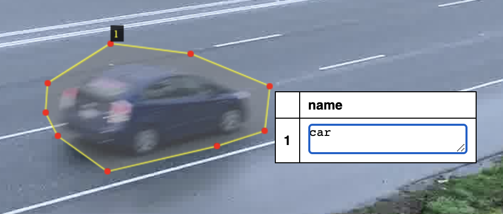

# Mask R-CNN Utils

Mask R-CNN is an algorithm for instance segmentation.

Based on:  https://github.com/matterport/Mask_RCNN ("Training on Your Own Dataset" section)

This repository allows the user
- [x] Bring their own data
- [x] Train on one class

Todo
- [ ] Train for multiple classes

Example of detecting instances of balloons with Mask R-CNN:

<a href="https://nypost.com/2019/01/20/releasing-balloons-in-east-hampton-could-cost-you-jail-time/" target="_blank">Original image source</a>

## Setup

It is recommended to use a <a href="https://docs.python.org/3/library/venv.html" target="_blank">virtual environment</a> or <a href="https://docs.conda.io/projects/conda/en/latest/user-guide/tasks/manage-environments.html" target="_blank">conda envrionment</a> so as to not conflict with other Python library versions that may be installed.

Within a chosen Python 3 environment, install necessary libraries for this project with:

`pip install -r requirements.txt`

## Data

Split dataset images into training, validation and test sets.  (e.g. split all images 60/20/20), create and place them in separate folders (`data/train`, `data/val`, `data/test`).

### Label

Download the <a href="http://www.robots.ox.ac.uk/~vgg/software/via/" target="_blank">VGG Image Annotator</a> browser app to run locally.

Use VGG Image Annotator to label your images for instance segmentation
- Open VGG Image Annotator in the browser (IMPORTANT:  make sure you do not refresh browser before saving because it will wipe all of the images and labels loaded/created)
- Upload each set separately (e.g. upload only train images to browser app)
- Create an Attribute --> "Regions Attributes" tag by typing "name" in the "attribute name" field, seleting "+" and keeping the default setting, ensuring "Name" is also "name".

IMPORTANT:  give the attribute/label a "Def." or default name of "class1" (if this is different change it in `custom.py` on line 98 as well).

- Label using polygons and then clicking back on the polygon to select the tag "name", then typing in the class name, ensuring consistent spelling for each class.

- Click the Annotation menu item to save the annotations "as json" to the correct folder (e.g. `data/train`) naming the file in each folder `via_region_data.json` (the program will look for this file name specifically!).

## Download model

Get the model from <a href="https://github.com/matterport/Mask_RCNN/releases/tag/v2.0" target="_blank">the release page here</a>.  Look under "Assets" at the bottom for `mask_rcnn_coco.h5` and click to download.  Place the model file into the base of this repo.

## Training

- Create `logs` folder in base of repo (this folder is where the trained models will be saved)
- Run training script as follows

`python3 custom.py train --dataset=/path/to/dataset --weights=coco --logs logs`

or, alternatively:

- Resume training a model that you had trained earlier

`python3 custom.py train --dataset=/path/to/dataset --weights=last`

- Train a new model starting from ImageNet weights

`python3 custom.py train --dataset=/path/to/dataset --weights=imagenet`

## Inference

- Apply color splash to an image

`python3 custom.py splash --weights=/path/to/weights/file.h5 --image=<URL or path to file>`

- Apply color splash to video using the last weights you trained

`python3 custom.py splash --weights=last --video=<URL or path to file>`

For help, type `python3 custom.py --help`

## Run the trained model in a Python demo app

Navigate to this repo for an example application to demo the model:  https://github.com/michhar/maskrcnn-python-app

## Credits

- https://github.com/matterport/Mask_RCNN
- https://engineering.matterport.com/splash-of-color-instance-segmentation-with-mask-r-cnn-and-tensorflow-7c761e238b46

