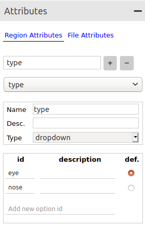
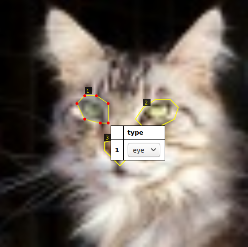
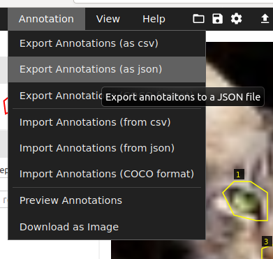

# Keras Mask R-CNN on Custom Classes

This repository allows the user to
- [x] Bring their own data (must label it in walkthrough below)
- [x] Train an instance segmentation model for multiple classes
- [x] Score on images and video
- [ ] Evaluate model mAP

Mask R-CNN is an algorithm for instance segmentation.

Based on:  https://github.com/matterport/Mask_RCNN ("Training on Your Own Dataset" section)

Example of detecting instances of balloons with Mask R-CNN:


<div align="right"><a href="https://nypost.com/2019/01/20/releasing-balloons-in-east-hampton-could-cost-you-jail-time/" target="_blank">Original image source</a></div>

## Setup

It is recommended to use a <a href="https://docs.python.org/3/library/venv.html" target="_blank">virtual environment</a> or <a href="https://docs.conda.io/projects/conda/en/latest/user-guide/tasks/manage-environments.html" target="_blank">conda envrionment</a> so as to not conflict with other Python library versions that may be installed.


Within a chosen Python 3 environment, install necessary libraries for this project with:

`pip install -r requirements.txt`

## Data

Create a folder called `data` in the base of the repo.

Split dataset images into training, validation and test sets.  (e.g. split all images 60/20/20), create and place them in separate folders (`data/train`, `data/val`, `data/test`).

### Label

Download the <a href="http://www.robots.ox.ac.uk/~vgg/software/via/" target="_blank">VGG Image Annotator</a> browser app to run locally (tested with **version 2.0.10**).

Here, we will use the VGG Image Annotator to label images for instance segmentation using the polygon setting.

IMPORTANT:  make sure you do not refresh browser before exporting the labels because it will wipe all of the images and labels loaded/created.

Instructions:
1. Open VGG Image Annotator in a browser (if downloaded, look for the `via.html` file and click on this to open the tool)
2. Load the **train** images (we will label **val** separately) with "Add Files" button
3. Under "Region Shape", select "Polygon region shape"
4. To create a label, under "Attributes" and "Region Attributes", in the text field, enter the word **"type"** (important, please keep as this) and hit the "+".  Name the label **"type"** as well, and for the "Type" field select "dropdown".  Add one "id" per class as shown below (this example has two classes, eye and nose, with eye as the default).



5. Use the mouse and draw polygons around the object of interest, then click back into the region and use the dropdown menu to select the class.



6. Click the Annotation menu item to save the annotations "as json" to the correct folder (`data/train`) **renaming the file in each folder `via_region_data.json`** (the program will look for this file name specifically!).



* Do the same as above for the `val` folder of images (the required validation set), saving a file called `via_region_data.json` to the `data/val` folder.  The `test` folder does not _need_ labels and is only for you to test single images after you have a trained model.

IMPORTANT:  Now, update line 61 (CLASS_NAME list) in `custom.py` with your class names.

## Download model

Get the model from <a href="https://github.com/matterport/Mask_RCNN/releases/tag/v2.0" target="_blank">the release page here</a>.  Look under "Assets" at the bottom for `mask_rcnn_coco.h5` and click to download.  Place the model file into the base of this repo.

## Training

- Create `logs` folder in base of repo (this folder is where the trained models will be saved)
- Run training script as follows.

`python3 custom.py train --dataset=data --weights=coco --logs logs`

or, alternatively:

- Resume training a model that you had trained earlier (it will look for last folder in the `logs` directory by default)

`python3 custom.py train --dataset=data --weights=last`

## Inference

- Apply color splash to an image (all greyscale except for masks which show original color - see Credits)

`python3 custom.py splash --weights=/path/to/weights/file.h5 --image=<URL or path to file>`

- Apply color splash to video using the last weights you trained

`python3 custom.py splash_movie --weights=last --video=<URL or path to file>`

- Apply regular detection (bounding box and scores) and masking to video

`python3 custom.py classic_movie  --weights=/path/to/weights/file.h5 --video=<URL or path to file>`

For help, type `python3 custom.py --help`

## Run the trained model in a Python demo app

Navigate to this repo for an example application to demo the model:  https://github.com/michhar/maskrcnn-python-app

## Credits

- [Mask R-CNN for Object Detection and Segmentation codebase](https://github.com/matterport/Mask_RCNN)

    - Associated paper:
    ```
    @misc{matterport_maskrcnn_2017,
      title={Mask R-CNN for object detection and instance segmentation on Keras and TensorFlow},
      author={Waleed Abdulla},
      year={2017},
      publisher={Github},
      journal={GitHub repository},
      howpublished={\url{https://github.com/matterport/Mask_RCNN}},
    }
    ```
- [Splash of Color: Instance Segmentation with Mask R-CNN and TensorFlow](https://engineering.matterport.com/splash-of-color-instance-segmentation-with-mask-r-cnn-and-tensorflow-7c761e238b46)
- [Cat face image collection](https://github.com/Ferlix/Cat-faces-dataset)

## Labe tool citation

Abhishek Dutta and Andrew Zisserman. 2019. The VIA Annotation Software for Images, Audio and Video. In Proceedings of the 27th ACM International Conference on Multimedia (MM ’19), October 21–25, 2019, Nice, France. ACM, New York, NY, USA, 4 pages. https://doi.org/10.1145/3343031.3350535.

```
@inproceedings{dutta2019vgg,
  author = {Dutta, Abhishek and Zisserman, Andrew},
  title = {The {VIA} Annotation Software for Images, Audio and Video},
  booktitle = {Proceedings of the 27th ACM International Conference on Multimedia},
  series = {MM '19},
  year = {2019},
  isbn = {978-1-4503-6889-6/19/10},
  location = {Nice, France},
  numpages = {4},
  url = {https://doi.org/10.1145/3343031.3350535},
  doi = {10.1145/3343031.3350535},
  publisher = {ACM},
  address = {New York, NY, USA},
}

@misc{dutta2016via,
  author = "Dutta, A. and Gupta, A. and Zissermann, A.",
  title = "{VGG} Image Annotator ({VIA})",
  year = "2016",
  howpublished = "http://www.robots.ox.ac.uk/~vgg/software/via/",
  note = "Version: X.Y.Z, Accessed: INSERT_DATE_HERE"
}
 ```
